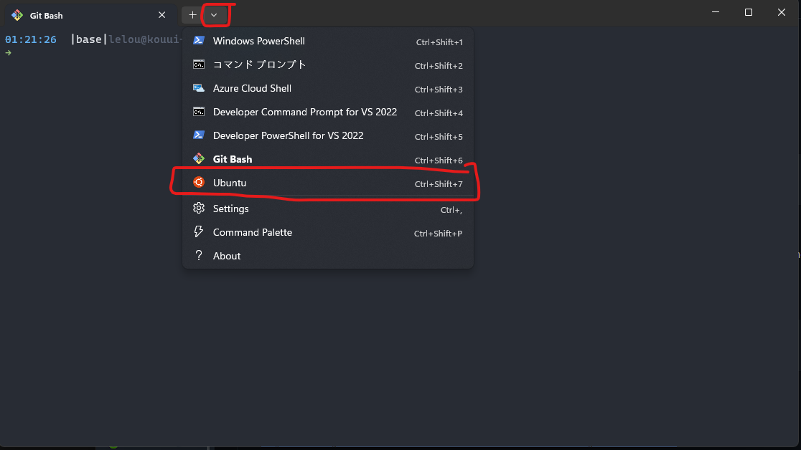
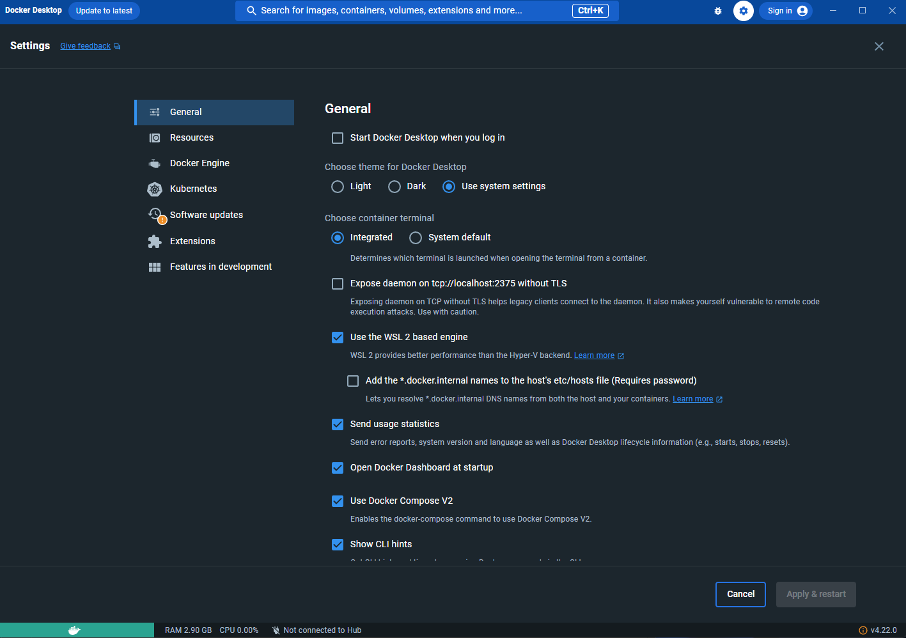
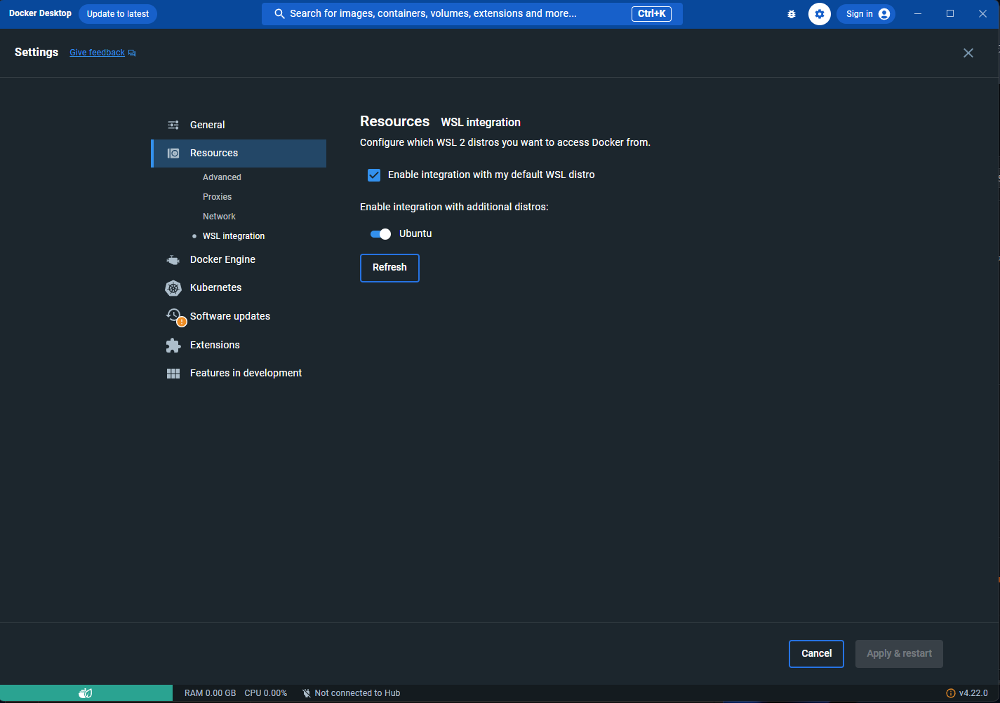
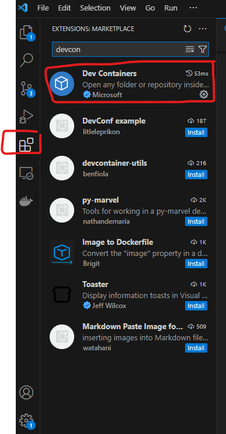
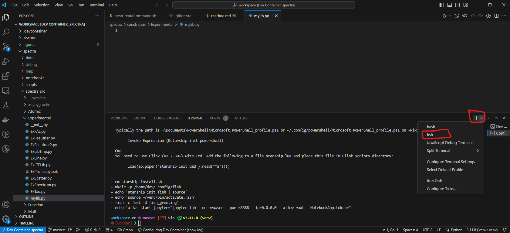

# SPECTRA

## install

### prepare environment for devcontainer

#### WSL(ubuntu) in Windows

reference : <https://qiita.com/whim0321/items/ed76b490daaec152dc69>

open CMD as admin

```
> wsl --set-default-version 2
> wsl --install
```

linux subsystem (Ubuntu kernel in default) will be installed.
after installation, you need to restart your PC.

after restarting your PC,  in Windows, open terminal, now you are able to open a terminal with Ubuntu kernel. 


At first, you have to setup your username and password. (don't forget your password)

then install `git`

```bash
sudo apt-get update
sudo apt-get install git
```

#### docker desktop

download the installer of docker desktop on Windows from
<https://desktop.docker.com/win/main/amd64/Docker%20Desktop%20Installer.exe>

after installation. open docker desktop, move to settings page, make sure the settings is configured as follow



#### microsoft vscode

download the installer of microsoft vscode from <https://code.visualstudio.com/>

*choose Windows x64 User Installer stable*

open vscode, install the extension called `Dev Containers`



### install spectra

open your ubuntu terminal, move to your workspace

```
cd /path/to/your/workspace/as/you/like
git clone https://github.com/kouui/spectra-devcontainer.git spectra
```

## usage

### quick start

*in windows*

**keep docker desktop running**

*in WSL(ubuntu)*

move to the directory of SPECTRA

```bash
cd /path/to/spectra
code .
```

then you should see your vscode window popup.
type `F1` and then select `Dev Containers: Reopen in container`.
then the linux environment for SPECTRA will be built/started.

*in devcontainer(Linux)*

start jupyter lab

```bash
workspace on  master [?] via 🐍 v3.11.8 (venv) 
⬢ [Docker] ❯ start-jupyter
```

then in windows, open your web browser, type `localhost:8888` and hit enter.
just have fun!

to start a new shell,


#### aware

in `notebooks/basic` you can find some notebook tutorials (some of them are out of date!).
**do not modify notebooks in `notebooks/basic` directly, because your modification will be overwriten once you synchronize the local code to the remote repository.**

one way is to create a folder in `notebooks`, for example, `notebooks/my-notebooks`.
besides `notebooks/basic`, any folder in `notebook/` will not be checked during code synchronization.

### update source code

### code development
